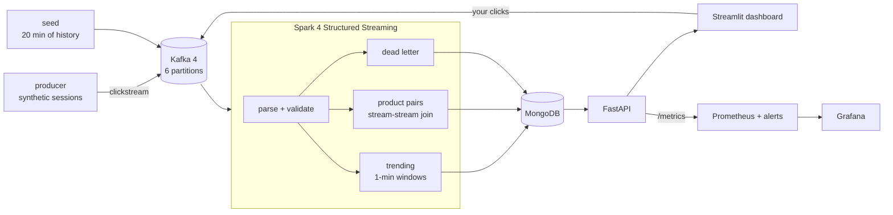

# Streaming Product Affinity Pipeline

[](https://github.com/BrishavDebnath/streaming-product-affinity/actions/workflows/ci.yml)
[](https://github.com/BrishavDebnath/streaming-product-affinity/actions/workflows/codeql.yml)
[](https://github.com/BrishavDebnath/streaming-product-affinity/blob/main/.github/workflows/ci.yml)
[](https://kafka.apache.org/)
[](https://spark.apache.org/docs/latest/structured-streaming-programming-guide.html)
[](LICENSE)

*A streaming data-engineering project: Kafka 4 -> Spark 4 Structured Streaming
-> MongoDB -> FastAPI. It finds products that shoppers view together in the
same session, using co-occurrence statistics - no machine learning yet. See
[Scope](#scope) before reading further.*

Clickstream events flow through **Kafka** into **Spark Structured Streaming**,
which computes windowed **trending products** and **co-viewed product pairs**
("shoppers who viewed A in a session also viewed B"), writes them idempotently
to **MongoDB**, and serves them over **FastAPI** with a **Streamlit**
dashboard and **Prometheus/Grafana** monitoring.



Every box is a container. One `docker compose up` starts them all.

---

## Scope

This is a **streaming data-engineering** project. The "related products"
layer is deliberately simple: session-scoped co-occurrence ranked by affinity,
lift or PMI - the same family as classic item-to-item "viewed together"
features.

What it does **not** do, and does not claim to:

- **No personalisation.** `/related-products/{product_id}` answers "what goes
  with this item", not "what should *this shopper* see next". There is no user
  model, so nothing here is called a recommendation.
- **No machine learning.** Lift is a statistic, not a trained model. ML is
  planned - see [Roadmap](#roadmap).
- **Evaluation needs the real dataset.** On the generated traffic there is
  nothing honest to measure - the ground truth would be the generator's own
  affinity table. Hit-rate@10 is measured on real RetailRocket clickstream
  instead, which is a download away: see
  [Real traffic](#real-traffic-and-whether-the-recommendations-are-any-good).

The engineering is where the work is: bounded streaming state, idempotent
writes, dead-letter handling, schema-version coexistence, and a tested
transform layer. Those are all demonstrated and measured below.

<!--
## Demo

Capture these while the stack is running (see docs/screenshots/README.md),
save them in docs/screenshots/, then remove this comment wrapper.


-->

## Prerequisites

| | |
|---|---|
| **Docker Desktop** (or Docker Engine with Compose v2.24+) | runs everything |
| **Git** | to clone the repository |
| **Python 3.11 or 3.12** *(optional)* | only to run scripts or the full test suite directly on your machine |

Give Docker at least **8 GB of memory** (Docker Desktop on Windows uses half
your RAM by default). The Spark driver is set to 4 GB and MongoDB's cache to
1 GB. The first build downloads the Spark 4.1 image, the Kafka connector JARs
and the Python packages, so expect several minutes.

Ports used: `8501` dashboard, `8000` API, `3000` Grafana, `9090` Prometheus,
`4040` Spark UI, `9092` Kafka, `27018` MongoDB.

## Quick start

The same commands work in PowerShell, macOS and Linux.

```bash
git clone https://github.com/BrishavDebnath/streaming-product-affinity.git
cd streaming-product-affinity
docker compose up -d --build
```

That starts, in order:

1. **Kafka** and **MongoDB**, then **kafka-init**, which creates the
   `clickstream` topic with 6 partitions.
2. The **Spark** job, the **API** and **Prometheus/Grafana**.
3. **seed** - backfills 20 minutes of past sessions (skipped if MongoDB already
   has results), so the dashboard is not empty.
4. The **producer** - live synthetic traffic, about 20 events/s - and the
   **dashboard**.

Then open:

| | |
|---|---|
| Dashboard | http://localhost:8501 |
| API docs | http://localhost:8000/docs |
| Grafana | http://localhost:3000 |
| Prometheus (targets, alerts) | http://localhost:9090 |
| Spark UI | http://localhost:4040 |

**Expect trending within a minute and live product pairs after about five.**
The stream-stream join holds its output back by `CO_VIEW_GAP`, so a pair is
saved only once events arrive roughly `COOCCURRENCE_WINDOW + CO_VIEW_GAP +
WATERMARK` later (1 + 2 + 2 minutes by default). Raising the gap to 10 minutes
pushes that to ~17 minutes; this was measured on Spark 3.5 and 4.1, not
estimated. Keep the producer running: windows only close when newer events
arrive.

## Everyday commands

| | |
|---|---|
| Status | `docker compose ps` |
| Logs | `docker compose logs -f spark` (or `api`, `producer`, ...) |
| End-to-end check (up to ~9 min) | `docker compose run --rm smoke` |
| Throughput and latency benchmark (~25 min) | `docker compose run --rm loadtest` |
| Crash-recovery test (~7 min) | `docker compose run --rm recovery` |
| Unit tests (Spark container) | `docker compose run --rm --no-deps spark /opt/spark/bin/spark-submit /app/tests/test_transforms.py` |
| Stop, keep data | `docker compose down` |
| Stop and delete all data | `docker compose down -v` |

Settings live in `.env` (copy `.env.example`); every value has a default.
After changing one, run `docker compose up -d` again. Changing
`KAFKA_PARTITIONS`, `SHUFFLE_PARTITIONS`, `STATE_STORE` or a window size needs
a fresh start (`docker compose down -v`), because Spark will not resume from a
checkpoint whose plan has changed.

A `Makefile` wraps the same commands for macOS and Linux (`make up`,
`make smoke`, `make test`, `make loadtest`, ...).

### Running scripts on your machine (optional)

Only needed for development. The containers already publish Kafka on
`localhost:9092` and MongoDB on `localhost:27018`.

```bash
python -m venv .venv
.venv\Scripts\activate          # Windows;  macOS/Linux: source .venv/bin/activate
pip install -r requirements.txt
cp .env.example .env              # Windows: copy .env.example .env
# PowerShell: $env:PYTHONPATH = "."   macOS/Linux: export PYTHONPATH=.
python scripts/smoke_test.py
```

Running the unit tests natively needs Java 17+ as well:
`pip install -r requirements-test.txt`, then `python tests/test_transforms.py`.

---

## How product pairs are found

The core is a **stream-stream self-join** on the browsing session
(`session_id`), constrained so both events fall within `CO_VIEW_GAP` of each
other. It originally joined on `user_id`; with users continuously active that
paired everything with everything ([ADR 0002](docs/adr/0002-session-keyed-cooccurrence.md)).
Events without a session id fall back to a key derived from the user.

```python
left.join(right,
    (col("l_session") == col("r_session"))
    & (col("l_product") < col("r_product"))          # each pair once
    & (col("r_time") >= col("l_time") - expr("INTERVAL 2 minutes"))
    & (col("r_time") <= col("l_time") + expr("INTERVAL 2 minutes")))
```

Four details matter:

- **The time constraint is what bounds the join state.** Without it Spark must
  retain every event forever, in case a future event joins to it. It also
  delays output by the same amount, which is why the gap is kept short.
- **`l_product < r_product`** means (A,B) and (B,A) are one row. The mirror is
  written at sink time so a lookup on either product finds it.
- **Weak pairs are hidden.** A pair seen fewer than `MIN_PAIR_COUNT` (3)
  times in the lookback is left out of related products and the graph.
- **Pairs are weighted, not counted.** A `purchase` is worth 5.0 and a `search`
  0.5 (`config.EVENT_WEIGHTS`); pair affinity is the geometric mean, so one
  strong plus one weak signal ranks below two strong ones.

### Where the structure in the demo data comes from

The data is synthetic, and its structure is **designed**, not discovered.
`catalog.session_products` generates each visit: the first product is random,
and each further product comes from a related category (`AFFINITY` in
`src/common/catalog.py`: laptops with laptop accessories, phones with phone
accessories and audio, footwear with footwear) - or, with probability
`CROSS_CATEGORY_RATE` (15%), from any category, because real shoppers wander.

The streaming job knows nothing about categories. It only sees which products
appeared in the same session, so the clusters on the dashboard are the
pipeline **rediscovering** a rule that was put into the data - a known-answer
test of the pipeline, not a finding about shoppers. With 15% wandering,
simulated related pairs score a lift of about 6-14 and chance pairs about
0.7-3.5, which is exactly the separation lift is meant to provide. For real
clickstream instead of a rediscovered rule, see
[Real traffic](#real-traffic-and-whether-the-recommendations-are-any-good).

Uniform random events would make every pair equally likely and leave nothing
to find; `docker compose run --rm smoke` checks that laptops really do pair
with laptop sleeves.

---

## Bounded state

Every stateful operation is windowed. This is not stylistic. A streaming
aggregation grouped only by business keys retains state for every key it has
ever seen — the watermark cannot evict it, because `event_time` is not part of
the grouping key. Measured on a rate source at 200 rows/s:

| | state rows over time |
|---|---|
| `groupBy("user_id", "product_id")` — no window | 0 → 1600 → 2400 → **3200** in 12 s, growing linearly |
| `groupBy(window(event_time, ...), key)` | **flat at 100** across 45 s |

The first is a slow memory leak that looks fine in a five-minute demo and
takes the job down in production.

`tests/test_transforms.py` asserts `numRowsTotal` stays bounded in a real
streaming query.

---

## Correctness properties

**Idempotent writes.** Both aggregate sinks upsert on a natural key —
`(window_start, window_end, product_id)` for trending, and the same plus
`related_product_id` for pairs — so replaying a batch after a failure
converges rather than duplicating. Unique indexes enforce this at the database
level too. The dead-letter sink appends instead: a rejected payload is
evidence of one delivery, and two deliveries of the same broken event are two
facts worth keeping.

**Nothing is silently dropped.** Events failing validation are routed to a
dead-letter collection with the reason and the original payload, instead of
becoming nulls. The producer emits malformed events at `MALFORMED_RATE` so the
path is continuously exercised.

**Exactly-once results across a crash.** `docker compose run --rm recovery`
kills the Spark container mid-stream with SIGKILL, restarts it, and checks
that every event Kafka acknowledged was counted exactly once. Spark resumes
from the offsets and state in its checkpoint; a batch cut short by the kill is
re-run, and the upserts make the re-run harmless.

**Cold start is answered explicitly.** A product with no co-occurrence data
yet returns trending products, and the response says
`"source": "trending_fallback"` rather than pretending the two are the same.

---

## Real traffic, and whether the recommendations are any good

The demo generator proves the pipeline works; it cannot prove the
recommendations are useful, because the structure it finds is the structure
that was put there. So the same pipeline also runs on
[RetailRocket](https://www.kaggle.com/datasets/retailrocket/ecommerce-dataset):
2.7M real events (views, add-to-carts, transactions) from a real shop over four
and a half months.

```bash
pip install -r requirements-data.txt
python scripts/fetch_dataset.py          # needs a Kaggle legacy API key
docker compose run --rm replay --days 7  # a week of real traffic, in ~5 minutes
docker compose run --rm evaluate --train-days 7 --test-days 7
```

Three things have to happen for real data to work here, and each one is a
decision rather than a detail ([ADR 0011](docs/adr/0011-real-data-and-evaluation.md)):

- **Visits, not visitors.** RetailRocket has no session id. Events are cut into
  visits at 30 minutes of inactivity, so two products a shopper saw three weeks
  apart are never treated as viewed together.
- **The replay's own clock.** The events are from 2015; replayed as-is, every
  window would land outside the API's lookback and the dashboard would look
  broken. Timestamps are mapped onto the replay's clock, keeping order and
  relative spacing, compressed by a fixed factor (~2000x for a week in five
  minutes). The replay prints the factor and warns if visits become shorter
  than the co-view gap.
- **Real labels.** RetailRocket hashes its item properties, so there are no
  product names. The catalogue built for a replay says `Item 214536500`,
  `cat-1037`. Inventing names would make the screenshots prettier and the
  project dishonest.
- **Closing the last windows.** A watermark moves on event time, and during a
  replay nothing else produces any. So the replay ends by sending a few events
  timestamped past the end of the slice - one reserved product id, one session
  each, so they can form no pair - and deletes their own rows afterwards.
  Without them the last two minutes of a five-minute replay would never be
  counted.

**How it is scored.** Train on the replayed days; test on the days after, which
the pipeline has never seen. For each held-out visit, the model gets the first
product and returns ten; a hit is when the product the shopper actually viewed
**next** is among them. The baseline answers every query with the ten
most-viewed products of the training period — what a shop does with no
recommender at all. Both get identical test cases, and the pipeline's answers
come from the live `/related-products` endpoint, not a re-implementation.

**Measured**, on 3,000 held-out visits: one week of RetailRocket traffic
(144,671 events) replayed through Kafka, tested on the following week.

| | hit-rate@10 | Coverage | vs baseline |
|---|---:|---:|---:|
| **Pipeline**, as the API serves it | **9.13%** | 73% | **12.5x** |
| Pipeline, co-occurrence only (no fallback) | 7.90% | 33% | 10.8x |
| Bestsellers (top 10 of the training week) | 0.73% | 100% | — |

Coverage — the share of queries that got a real co-occurrence answer rather
than the trending fallback — is reported next to the hit-rate, because an
average that hides it is not an honest number. The figure is conservative:
796 of the 3,000 query products had never appeared in the training week, and
every one counts as a miss for the pipeline while the bestseller list still
answers. Details, and what the number does not claim, in
[docs/EVALUATION.md](docs/EVALUATION.md); the raw run is in
`results/evaluation.json` (written locally; `results/` is git-ignored).

---

## Measured performance

Measured on an 8-core i5-13450HX with 12 GB of memory given to Docker, with
Kafka, Spark, MongoDB and the load generator all sharing those cores. Full
results, and how to reproduce them: [docs/BENCHMARKS.md](docs/BENCHMARKS.md).

- **15,000 events/s sustained.** Spark read every event, the backlog stayed
  flat and cleared 16 s after the load stopped. At 20,000 events/s it falls
  behind: batches take 15.6 s against a 10 s trigger.
- **An event reaches its trending row in about 8 s** (median) at 2,500-5,000
  events/s, and in 15 s at the 95th percentile at 15,000 events/s. Most of
  that is the wait for the next 10 s trigger.
- **A product pair appears about 5 minutes after the events**, by design: its
  window, the co-view gap and the watermark all have to pass first.
- **Crash recovery:** Spark killed with SIGKILL under load wrote its first new
  result 12 s after restarting and cleared the 38,471-event backlog 15 s after
  restarting. All 120,224 events were counted exactly once - none lost, none
  double-counted.
- **The co-occurrence join held 4.7M events at 15,000 events/s** and stayed
  bounded: RocksDB keeps that off the JVM heap, and the 2-minute co-view gap
  is what caps it (`results/load_test.csv`).

Two scripts produce these numbers against the running stack:

- **`loadtest`** ramps the event rate (2,500 to 20,000 events/s by default,
  90 s each) with six producer processes sending realistic sessions. For
  each step it records what Spark itself reported (events read, batch time,
  unread backlog) and whether Spark kept up: the backlog must not climb during
  the step and must clear within two trigger intervals afterwards. Probe
  events with unique product ids time the path from sending an event to its
  row appearing in MongoDB.
- **`recovery`** kills Spark under load and measures how quickly it resumes
  and whether any event was lost or double-counted.

Everything shares one machine's cores, so the figures describe a laptop, not
a cluster. See [ADR 0010](docs/adr/0010-measuring-the-pipeline.md) for why
the measurements are taken this way.

---

## Tested

**114 tests, no Kafka and no MongoDB needed**, in four groups:

| What | How | Where it runs |
|---|---|---|
| Spark transforms and the streaming plan | a real local `SparkSession` | `pytest`, and `docker compose run --rm --no-deps spark ...` |
| The API | the real FastAPI app over an in-memory MongoDB (mongomock) | `pytest tests/test_api.py` |
| The dashboard | Streamlit's `AppTest` runs the real page against the real API | `pytest tests/test_dashboard.py` |
| The real-data path | sessions, replay timing and the evaluation, plus the whole evaluation script over a fake pair table | `pytest tests/test_data.py` |

The Spark group is also a script: `spark-submit tests/test_transforms.py`
runs it inside the Spark container with no pytest installed, reporting its
**172 individual checks**. `pytest` turns any failed check into a failed test,
so both routes agree. The Spark group starts a JVM and one Python process per
core, so give it a couple of free gigabytes - on a laptop already running the
stack, prefer the container route.

What the tests cover:

- parsing, type coercion, weighting, and rejection reasons
- garbage payloads route to the DLQ rather than crashing the job
- trending counts, weighted scores, distinct users, window separation
- co-occurrence finds co-viewed pairs, ignores events outside the gap, never
  pairs a product with itself, and never pairs two different users
- a **genuine streaming query** — file source → watermark → stream-stream
  join → windowed aggregation → memory sink — asserting the pair is emitted,
  that counts aggregate across users, and that state stays bounded
- ten minutes of steady sessions, showing the join state stops growing once
  the co-view gap and watermark have passed
- lift and PMI maths, and that pairs with an undefined lift rank below real ones
- the monitoring listener can be built, reads Spark's progress objects, and
  measures Kafka lag against the broker rather than Spark's planning snapshot
- sinks stamp rows at the moment they are written, in bounded chunks, and
  their writers can be shipped to Spark's Python workers
- the benchmark helpers: percentiles, the kept-up rule, report sections, and
  Docker's timestamps
- the dashboard reads only fields the API actually returns
- the session-generation rule, the RocksDB state store, and that Compose
  starts every service in a safe order with Prometheus loading its alerts
- the real-data path: a returning visitor is a new visit, replayed timestamps
  keep their order and spacing, replaying a slice twice produces the same event
  ids, a recommender that echoes the query back never scores, an empty answer
  is a miss rather than a skipped case, and a deliberately wrong model comes
  out below the bestseller baseline

The transforms are pure `DataFrame -> DataFrame` functions in
`src/streaming/transforms.py` precisely so this is possible. Streaming logic
that can only be verified by watching a dashboard cannot be refactored safely.

**On every push** (`.github/workflows/ci.yml`) GitHub Actions runs `ruff` and
`mypy`, then the whole test suite on Python 3.11 and 3.12 with a coverage
summary, and then the real thing: `docker compose up` for the entire stack,
followed by the end-to-end check against it.

```bash
pytest                      # everything, with coverage: make test-all
ruff check . && mypy        # the same lint and type checks CI runs: make lint
```

---

## API

| endpoint | purpose |
|---|---|
| `GET /health` | liveness + MongoDB reachability |
| `GET /throughput?windows=` | events per window — the pipeline's own measured rate |
| `GET /pipeline` | processing lag: window close → row written |
| `GET /graph?limit=&minutes=&min_pairs=&min_affinity=` | co-occurrence as nodes and edges, over the same lookback as related-products |
| `GET /trending?limit=&minutes=` | top products over the last N minutes, by weighted score (cached `CACHE_TTL_SECONDS`) |
| `GET /related-products/{id}?limit=&score_by=` | co-viewed products ranked by `affinity`, `lift` or `pmi`, with trending fallback |

**Three answers, not two.** `/related-products` and `/graph` answer from the
recent lookback where they can; when that window is empty they widen to
everything still retained and say so (`"window": "all_retained"`,
`"lookback_minutes": null`); only with no pairs at all does
`/related-products` fall back to trending. `/trending` never widens - it
reports the last N minutes and, when those are empty, says how old the newest
window is.
| `GET /stats` | collection counts, latest window, request counters |
| `GET /metrics` | Prometheus text format |

```bash
curl localhost:8000/related-products/9001 | jq
```

```json
{
  "product_id": 9001,
  "source": "co_occurrence",
  "ranked_by": "affinity",
  "window": "recent",
  "lookback_minutes": 30,
  "count": 1,
  "related_products": [
    {"product_id": 9003, "affinity": 42.6, "pair_count": 18,
     "peak_users_per_window": 4, "lift": 6.2, "pmi": 2.63, "score": 42.6,
     "name": "Laptop Sleeve 13\"", "price": 1499, "category": "laptop-acc"}
  ]
}
```

`lift` and `pmi` are null when the marginals needed to compute them are
missing, rather than being reported as zero ([ADR 0003](docs/adr/0003-lift-not-raw-counts.md)).

---

## Dashboard

Six sections, each showing the pipeline rather than decorating the page:

- **Pipeline health** — four tiles. *Processing delay* is
  `written_at - window_end`: how long after a one-minute window ends its final
  numbers are saved. A few seconds up to the trigger interval is healthy; a
  steadily rising number means the job cannot keep up. *Last update*, and the
  newest full minute's event count and rate, sit beside it — labelled with
  that window's time and age when the data is not current, so a stopped
  pipeline never reads as a running one.
- **Events per minute** — charted from what Spark actually wrote to MongoDB,
  not from a producer-side counter. If the producer is sending but this is
  flat, the bottleneck is downstream of Kafka. The caption states the window
  range it is showing.
- **Products** — click-to-send: *View* and *Add to cart* publish real events
  straight to Kafka, so you can watch your own click come back as a pair. The
  first twelve catalogue products are shown (a real catalogue has tens of
  thousands).
- **Trending now** and **Related products** — the two serving endpoints, with
  the answer's source named: co-occurrence, the widened all-retained window,
  or the trending fallback.
- **Products viewed together** — the product pairs as a graph: line thickness
  by affinity, the number on the line is how many times the pair was seen, box
  colour by category, with a legend listing the categories actually on the
  graph. Solid lines join related categories (laptop + sleeve with the demo
  catalogue, same category with a real one), dashed lines cross them. A slider
  shows more of the weaker links, and the side panel counts how many lines
  cross categories and lists the strongest five. The line style is display
  only — the pipeline never sees categories.

The graph is rendered with `st.graphviz_chart` from a generated DOT string, so
it needs no extra dependency — no networkx, no pyvis, no plotly.

## Layout

```
docker-compose.yml         the whole stack; Dockerfile.app / Dockerfile.spark build it
src/common/config.py       every tunable, from environment variables
src/common/catalog.py      product catalogue and the session-generation rule
src/common/kafka_io.py     Kafka serializers shared by every producer
src/common/mongo.py        one reused MongoDB client per process
src/streaming/transforms.py  pure, unit-tested Spark transformations
src/streaming/job.py       job wiring, idempotent Mongo sinks, indexes, metrics
src/producer/producer.py   live session generator
src/api/main.py            FastAPI serving layer and /metrics
src/ui/dashboard.py        Streamlit dashboard
scripts/seed.py            backfill of past sessions
scripts/smoke_test.py      end-to-end assertion against a running stack
scripts/load_test.py       throughput and latency benchmark
scripts/recovery_test.py   crash-and-restart test
src/common/bench.py        shared benchmark helpers (standard library only)
src/common/scoring.py      affinity, lift and PMI ranking - the score_by methods
src/data/retailrocket.py   real dataset: visits, event mapping, replay clock
src/data/evaluation.py     hit-rate@10 and the bestseller baseline
scripts/fetch_dataset.py   download and verify the RetailRocket export
scripts/replay.py          replay real traffic through Kafka
scripts/evaluate.py        score the pipeline on held-out days
monitoring/                Prometheus config, alert rules, Grafana dashboard
tests/test_transforms.py   Spark transform and streaming tests
tests/test_api.py          API tests over an in-memory MongoDB
tests/test_dashboard.py    the Streamlit page, run headless
tests/test_data.py         sessions, replay timing and the evaluation maths
tests/conftest.py          turns any failed check() into a failed pytest test
Makefile                   the same commands, wrapped (macOS and Linux)
pyproject.toml             pytest, coverage, ruff and mypy settings
```

Configuration is entirely environment-driven: the same code runs in the
containers (`kafka:29092`) and on your machine (`localhost:9092`).

---

## Monitoring

Prometheus (`:9090`) and Grafana (`:3000`) start with the rest of the stack.
Grafana opens straight on the **Streaming Product Affinity Pipeline**
dashboard - read-only, no login - charting Kafka consumer lag, ingest vs
processing rate, batch duration, state-store size (each per Spark query), the
related-products source mix, and the dead-letter count.

`/metrics` reports the value *now*; Prometheus scrapes the API container
(`api:8000`) every 10 s and keeps the history; Grafana draws it.

**Kafka lag** is the number of events a query has not read yet, measured
after each batch against the broker's latest offsets. Spark's own figure
(`maxOffsetsBehindLatest`) compares with the offsets it saw when it *planned*
the batch, so without a batch-size cap it is always 0. A sawtooth up to
(event rate x trigger interval) is normal; a rising floor means falling
behind.

**Alert rules** (`monitoring/alerts.yml`) are evaluated by Prometheus and
listed at http://localhost:9090/alerts: API down, pipeline stale for 2
minutes, Kafka lag above 1000 and rising, batches slower than the trigger
interval, and state that keeps growing. There is no Alertmanager, so nothing
is sent anywhere - the page shows what would page someone.

Grafana may flash an "Unauthorized" pop-up: its page asks the server who is
signed in (`/api/user`), and that request is refused for anonymous visitors.
It is harmless.

## Documentation

| | |
|---|---|
| [docs/adr/](docs/adr/) | 11 architecture decision records — what was chosen, and what was rejected |
| [docs/RUNBOOK.md](docs/RUNBOOK.md) | fault-tolerance demo, load testing, diagnosing lag |
| [docs/BENCHMARKS.md](docs/BENCHMARKS.md) | measured throughput, latency and crash recovery, written by the benchmark scripts |
| [docs/EVALUATION.md](docs/EVALUATION.md) | hit-rate@10 on real traffic against the bestseller baseline, written by `scripts/evaluate.py` |
| [DEFECTS_FIXED.md](DEFECTS_FIXED.md) | every defect found and how it was verified |

## Licence

MIT - see [LICENSE](LICENSE).

## Known limitations

1. **Co-occurrence is not collaborative filtering.** No matrix factorisation,
   no embeddings, no personalisation to a specific user's history. It answers
   "what is viewed with this" rather than "what should *you* see next".
   See the [Roadmap](#roadmap).
2. **The quality number needs the dataset.** Hit-rate@10 is measured on real
   RetailRocket traffic, which is a download away (`scripts/fetch_dataset.py`,
   free Kaggle account) rather than in the repository. On the generated
   traffic that ships with the project there is nothing honest to measure:
   the ground truth would be the generator's own affinity table.
3. **Single-broker Kafka.** Six partitions let Spark read in parallel, but
   with one broker nothing is replicated; broker failure and partition
   rebalancing are untested.
4. **Local Spark only.** `local[8]` in one container, never run on a real
   cluster, so executor tuning and network shuffles are untested.
5. **No authentication** on the API or the dashboard.
6. **Benchmarks are from one laptop.** Kafka, Spark, MongoDB and the load
   generator share the same cores, so the numbers show relative behaviour
   and where this setup saturates, not what a cluster would do.

## Roadmap

Planned, **not implemented**. The pipeline is being shaped so these can be
added without rewriting what exists.

- **Machine learning (later)** - the ranking methods are designed to be
  pluggable, so learned models can sit beside co-occurrence and be compared on
  the same evaluation: item2vec embeddings trained on sessions (Spark MLlib),
  ALS on implicit feedback, a session-based sequence model (e.g. SASRec),
  experiment tracking with MLflow, and optional LLM-written explanations.
