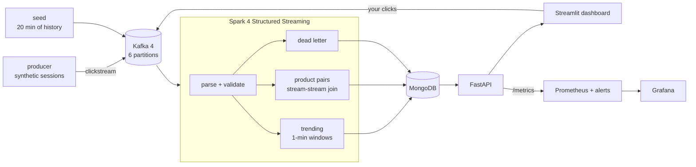
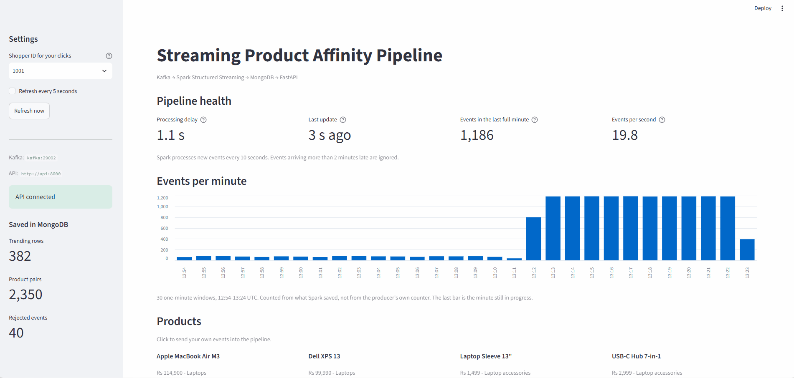
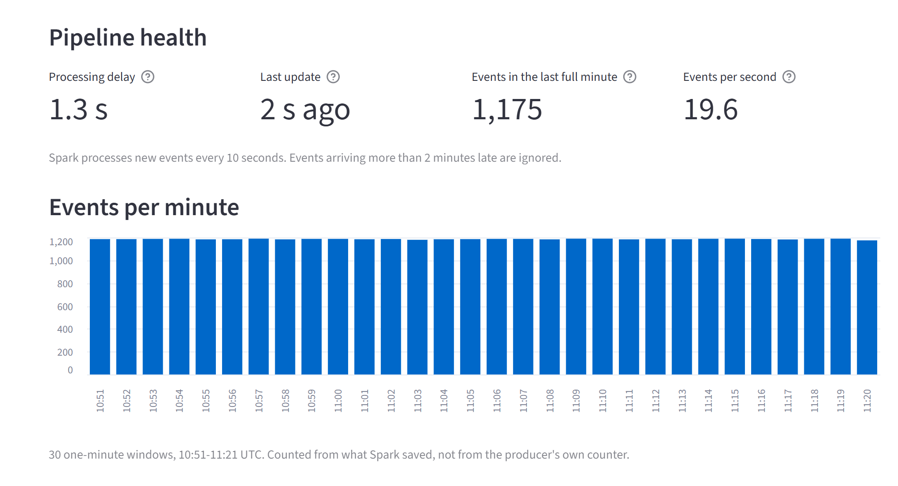
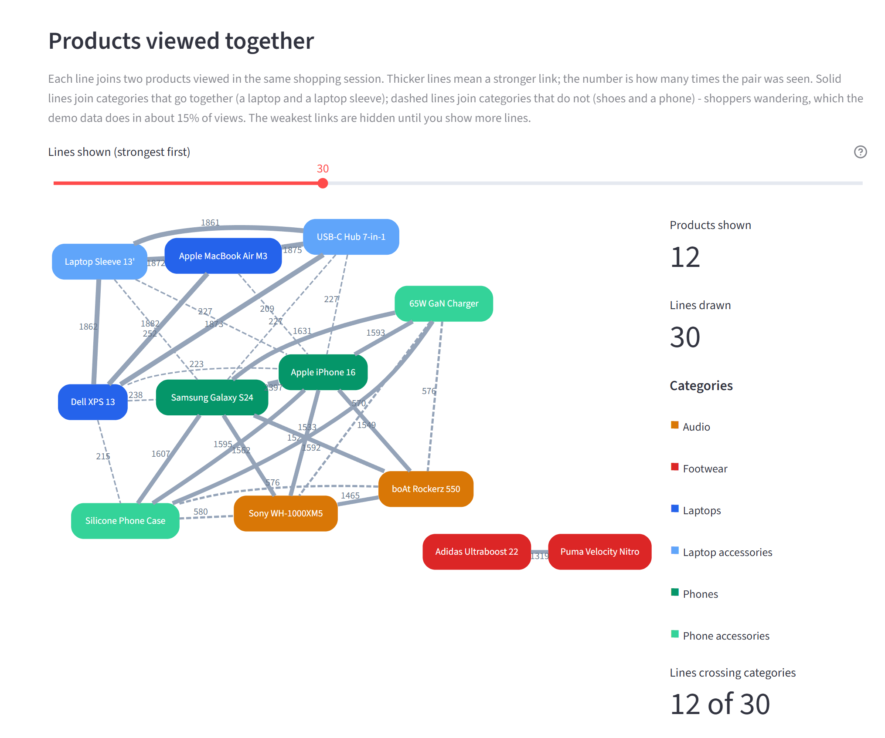
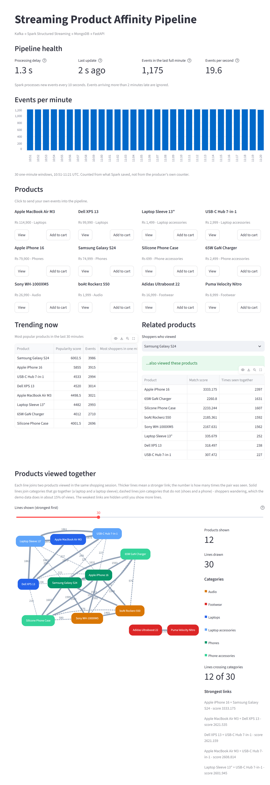
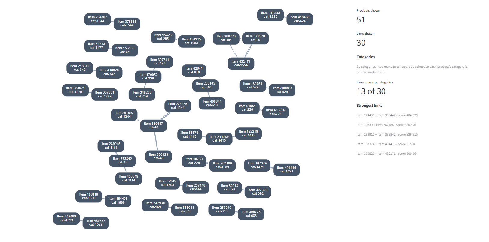

# Streaming Product Affinity Pipeline

[](https://github.com/BrishavDebnath/streaming-product-affinity/actions/workflows/ci.yml)
[](https://github.com/BrishavDebnath/streaming-product-affinity/actions/workflows/codeql.yml)
[](https://github.com/BrishavDebnath/streaming-product-affinity/blob/main/.github/workflows/ci.yml)
[](https://kafka.apache.org/)
[](https://spark.apache.org/docs/latest/structured-streaming-programming-guide.html)
[](LICENSE)

A streaming data pipeline built on Kafka 4, Spark 4 Structured Streaming, MongoDB and FastAPI. It finds products that shoppers look at together in the same visit, using co-occurrence counts. There is no machine learning in it yet, and the [Scope](#scope) section says exactly what it does and doesn't claim.

Click events go into Kafka. Spark reads them and keeps two running results: trending products per minute, and pairs of products viewed in the same session ("people who looked at A also looked at B"). Both are written to MongoDB in a way that can be safely repeated. FastAPI serves them, a Streamlit dashboard shows them, and Prometheus and Grafana watch the whole thing.



Each box is a container, and one `docker compose up` starts all of them.

## Scope

This is a data engineering project first. The "related products" part is kept simple on purpose: pairs of products seen in the same session, ranked by affinity, lift or PMI. It's the same idea as the classic "frequently viewed together" strip on a shop page.

It doesn't do personalisation. `/related-products/{product_id}` answers "what goes with this item", not "what should this particular shopper see next". There's no model of the user, which is why nothing here is called a recommendation engine.

It doesn't use machine learning either. Lift is a statistic, not a trained model. ML is planned, see the [Roadmap](#roadmap).

Measuring quality needs real data. The generated demo traffic has nothing honest to measure, because the right answer would just be the generator's own rules. So hit-rate@10 is measured on the real RetailRocket clickstream, which you can download for free: see [Real traffic](#real-traffic-and-whether-the-recommendations-are-any-good).

Most of the work went into the streaming side. Spark's memory stays bounded, writes are idempotent, bad events are kept instead of dropped, two event formats run side by side, and the transform code is tested. All of that is shown and measured below.

## Demo



*Clicking View and Add to cart sends real events to Kafka. Further down, pointing at a line in the graph shows how many times that pair was seen together.*



*Pipeline health. These numbers are read back from what Spark actually saved, not from the producer's own counter.*



*Products viewed in the same session. Solid lines join categories that belong together and dashed lines are shoppers wandering off. The pipeline is never told the categories, and it still finds them. The shoes end up on their own island because the demo traffic never sends a shoe shopper to electronics on purpose. Every dashed line in this picture (580 co-views at most) is weaker than every solid one (at least 1,319).*

<details>
<summary><b>The whole dashboard</b>: products you can click, trending, related products and the graph</summary>



</details>

## Prerequisites

| | |
|---|---|
| Docker Desktop (or Docker Engine with Compose v2.24+) | runs everything |
| Git | to clone the repository |
| Python 3.11 or 3.12 *(optional)* | only needed to run the scripts or the full test suite on your own machine |

Give Docker at least 8 GB of memory. Docker Desktop on Windows takes half your RAM by default. The Spark driver is set to 4 GB and MongoDB's cache to 1 GB. The first build downloads the Spark 4.1 image, the Kafka connector JARs and the Python packages, so expect it to take several minutes.

Ports used: `8501` dashboard, `8000` API, `3000` Grafana, `9090` Prometheus, `4040` Spark UI, `9092` Kafka, `27018` MongoDB.

## Quick start

These commands are the same in PowerShell, macOS and Linux.

```bash
git clone https://github.com/BrishavDebnath/streaming-product-affinity.git
cd streaming-product-affinity
docker compose up -d --build
```

That starts things in this order:

1. Kafka and MongoDB, then `kafka-init`, which creates the `clickstream` topic with 6 partitions.
2. The Spark job, the API, Prometheus and Grafana.
3. `seed`, which fills in 20 minutes of past sessions so the dashboard isn't empty. It skips itself if MongoDB already has results.
4. The producer, which sends live synthetic traffic at about 20 events a second, and the dashboard.

Then open:

| | |
|---|---|
| Dashboard | http://localhost:8501 |
| API docs | http://localhost:8000/docs |
| Grafana | http://localhost:3000 |
| Prometheus (targets, alerts) | http://localhost:9090 |
| Spark UI | http://localhost:4040 |

Trending shows up within a minute. Product pairs take about five. The join holds its output back by `CO_VIEW_GAP`, so a pair is only saved once events arrive roughly `COOCCURRENCE_WINDOW + CO_VIEW_GAP + WATERMARK` later, which is 1 + 2 + 2 minutes with the defaults. Raising the gap to 10 minutes pushes that to about 17 minutes. Those timings were measured on Spark 3.5 and 4.1, not estimated. Keep the producer running, because windows only close when newer events arrive.

## Everyday commands

| | |
|---|---|
| Status | `docker compose ps` |
| Logs | `docker compose logs -f spark` (or `api`, `producer`, ...) |
| End-to-end check (up to ~9 min) | `docker compose run --rm smoke` |
| Throughput and latency benchmark (~25 min) | `docker compose run --rm loadtest` |
| Crash-recovery test (~7 min) | `docker compose run --rm recovery` |
| Unit tests (Spark container) | `docker compose run --rm --no-deps spark /opt/spark/bin/spark-submit /app/tests/test_transforms.py` |
| Stop, keep data | `docker compose down` |
| Stop and delete all data | `docker compose down -v` |

Settings live in `.env` (copy `.env.example` to start). Every value has a default. After changing one, run `docker compose up -d` again. Changing `KAFKA_PARTITIONS`, `SHUFFLE_PARTITIONS`, `STATE_STORE` or a window size needs a clean start with `docker compose down -v`, because Spark won't resume from a checkpoint whose plan has changed.

On macOS and Linux there's also a `Makefile` with the same commands (`make up`, `make smoke`, `make test`, `make loadtest` and so on).

### Running the scripts on your own machine (optional)

You only need this for development. The containers already expose Kafka on `localhost:9092` and MongoDB on `localhost:27018`.

```bash
python -m venv .venv
.venv\Scripts\activate          # Windows;  macOS/Linux: source .venv/bin/activate
pip install -r requirements.txt
cp .env.example .env              # Windows: copy .env.example .env
# PowerShell: $env:PYTHONPATH = "."   macOS/Linux: export PYTHONPATH=.
python scripts/smoke_test.py
```

To run the unit tests outside Docker you also need Java 17 or newer. Then `pip install -r requirements-test.txt` and `python tests/test_transforms.py`.

## How product pairs are found

At the centre is a stream-stream self-join on the browsing session (`session_id`). Two events only join if they happened within `CO_VIEW_GAP` of each other. The first version joined on `user_id` instead, and because the simulated users are always active, that paired everything with everything ([ADR 0002](docs/adr/0002-session-keyed-cooccurrence.md)). Events with no session id fall back to a key built from the user.

```python
left.join(right,
    (col("l_session") == col("r_session"))
    & (col("l_product") < col("r_product"))          # each pair once
    & (col("r_time") >= col("l_time") - expr("INTERVAL 2 minutes"))
    & (col("r_time") <= col("l_time") + expr("INTERVAL 2 minutes")))
```

Four details matter here.

The time limit is what keeps Spark's memory bounded. Without it Spark would have to keep every event forever in case a later one joins to it. It also delays the output by the same amount, which is why the gap is short.

`l_product < r_product` means (A, B) and (B, A) are stored as one row. The mirror copy is written at the sink, so looking up either product finds the pair.

Weak pairs are hidden. A pair seen fewer than `MIN_PAIR_COUNT` times (3 by default) in the lookback is left out of related products and the graph.

Pairs are weighted by what the shopper did. A `purchase` is worth 5.0 and a `search` 0.5 (`config.EVENT_WEIGHTS`). A pair's affinity is the geometric mean of its two weights, so one strong signal plus one weak one ranks below two strong ones.

### Where the structure in the demo data comes from

The demo data is synthetic, and its structure was put there on purpose. `catalog.session_products` generates each visit. The first product is random. Each one after that comes from a related category, as set out in `AFFINITY` in `src/common/catalog.py`: laptops go with laptop accessories, phones with phone accessories and audio, and footwear with footwear. With probability `CROSS_CATEGORY_RATE` (15%) the next product comes from any category instead, because real shoppers wander.

The streaming job knows nothing about categories. All it sees is which products turned up in the same session. So the clusters on the dashboard are the pipeline finding a rule that was planted in the data. That makes it a test with a known answer, not a discovery about how people shop. With 15% wandering, related pairs get a lift of about 6 to 14 and chance pairs about 0.7 to 3.5, which is the kind of gap lift is supposed to show. For real clickstream data, see [Real traffic](#real-traffic-and-whether-the-recommendations-are-any-good).

If events were uniformly random, every pair would be equally likely and there'd be nothing to find. `docker compose run --rm smoke` checks that laptops really do pair up with laptop sleeves.

## Bounded state

Every stateful step in the job is windowed. It has to be. If a streaming aggregation groups only by business keys, Spark keeps state for every key it has ever seen. The watermark can't clear it, because `event_time` isn't part of the grouping key. Here's what that looks like on a rate source at 200 rows a second:

| | state rows over time |
|---|---|
| `groupBy("user_id", "product_id")`, no window | 0, 1600, 2400, then **3200** after 12 s, growing in a straight line |
| `groupBy(window(event_time, ...), key)` | **flat at 100** for 45 s |

The first one is a slow memory leak. It looks fine in a five-minute demo and takes the job down in production.

`tests/test_transforms.py` checks that `numRowsTotal` stays bounded in a real streaming query.

## Correctness properties

**Idempotent writes.** Both aggregate sinks upsert on a natural key. For trending that's `(window_start, window_end, product_id)`, and for pairs it's the same plus `related_product_id`. So if a batch is replayed after a failure, the result converges instead of doubling up. Unique indexes enforce this in the database as well. The dead-letter sink is the exception and appends. A rejected payload is evidence of one delivery, and two deliveries of the same broken event are two facts worth keeping.

**Nothing is silently dropped.** Events that fail validation go to a dead-letter collection along with the reason and the original payload. They don't turn into nulls. The producer sends malformed events on purpose, at `MALFORMED_RATE`, so this path is always being exercised.

**Exactly-once results across a crash.** `docker compose run --rm recovery` kills the Spark container mid-stream with SIGKILL, restarts it, and checks that every event Kafka acknowledged was counted exactly once. Spark picks up from the offsets and state in its checkpoint. A batch cut short by the kill runs again, and the upserts make that harmless.

**Cold start is handled openly.** A product with no pair data yet gets trending products back, and the response says `"source": "trending_fallback"` so nobody mistakes one for the other.

## Real traffic, and whether the recommendations are any good

The demo generator proves the pipeline works. It can't prove the results are useful, because the pattern it finds is the one that was put there. So the same pipeline also runs on [RetailRocket](https://www.kaggle.com/datasets/retailrocket/ecommerce-dataset): 2.7M real events (views, add-to-carts and purchases) from a real online shop over four and a half months.

```bash
pip install -r requirements-data.txt
python scripts/fetch_dataset.py          # needs a Kaggle legacy API key
docker compose run --rm replay --days 30  # a month of real traffic, in ~10 minutes
docker compose run --rm evaluate --train-days 30 --test-days 7
```

`--train-days` has to match the replay's `--days`. The replay writes down what it sent, and the evaluation refuses to score any other window. Testing on days the pipeline was trained on would inflate the score without any error.

Four things had to be decided to make real data work ([ADR 0011](docs/adr/0011-real-data-and-evaluation.md)):

- **Visits, not visitors.** RetailRocket has no session id, so events are split into visits after 30 minutes of inactivity. Two products a shopper looked at three weeks apart are never counted as viewed together.
- **The replay's own clock.** The events are from 2015. Replayed as they are, every window would fall outside the API's lookback and the dashboard would look broken. So the timestamps are moved onto the replay's clock, keeping their order and spacing and squeezing them by a fixed factor (about 2000x for a week in five minutes). The replay prints the factor and warns if visits get shorter than the co-view gap.
- **Real labels.** RetailRocket hashes its item properties, so there are no product names. The catalogue built for a replay says `Item 214536500` and `cat-1037`. Made-up names would make the screenshots prettier and the project dishonest.
- **Closing the last windows.** A watermark only moves forward with event time, and during a replay nothing else produces any. So the replay ends by sending a few events timestamped after the end of the slice. They all use one reserved product id and each has its own session, so they can't form a pair, and the replay deletes their rows afterwards. Without them, the last two minutes of a five-minute replay would never be counted.



*The same graph on real RetailRocket traffic after a 30-day replay. Real shopping looks nothing like the demo. Instead of a few dense clusters there are many small, separate pairs and short chains. 17 of the 30 strongest links join two products from the same category (the solid lines), and the pipeline never sees categories. The strongest pair, items 274435 and 369447, was viewed together 370 times.*

**How it's scored.** Train on the replayed days and test on the days after, which the pipeline has never seen. For each held-out visit, the pipeline is given the first product and returns ten. It scores a hit if the product the shopper actually viewed next is among those ten. The baseline answers every question with the ten most-viewed products from the training period, which is what a shop shows when it has no recommender at all. Both get exactly the same test cases, and the pipeline's answers come from the live `/related-products` endpoint, not a separate copy of the logic.

Measured on 3,000 held-out visits, with 30 days of RetailRocket traffic (617,109 events) replayed through Kafka and the following 7 days used for testing:

| | hit-rate@10 | Coverage | vs baseline |
|---|---:|---:|---:|
| **Pipeline**, co-occurrence only | **19.7%** | 64% | **26.9x** |
| Pipeline, as the API serves it (with fallback) | 17.4% | 89% | 23.8x |
| Bestsellers (top 10 of the training month) | 0.73% | 100% | n/a |

Coverage is the share of questions that got a real co-occurrence answer instead of the trending fallback. It sits next to the hit-rate because an average that hides it isn't an honest number. The two pipeline rows trade precision for coverage. The co-occurrence model is right 19.7% of the time on the 64% of questions it can answer, and the API as a whole scores 17.4% because it answers 89% of them. Either way the figure is on the cautious side. 1,068 of the 3,000 query products had no pairs at all in the training month, and every one of them counts as a miss for the pipeline while the bestseller list still gets to answer.

Scoring a different window from the one replayed would test the pipeline on its own training days. `scripts/replay.py` records what it sent and `scripts/evaluate.py` refuses a mismatch, because that mistake shows up as a 35.1% hit-rate and not as an error ([defect 85](DEFECTS_FIXED.md)). [docs/EVALUATION.md](docs/EVALUATION.md) has the details and what the number doesn't claim. The raw run is saved locally in `results/evaluation.json`, and `results/` is git-ignored.

## Measured performance

Measured on an 8-core i5-13450HX with 12 GB of memory given to Docker. Kafka, Spark, MongoDB and the load generator all share those cores. Full results and how to reproduce them are in [docs/BENCHMARKS.md](docs/BENCHMARKS.md).

- **15,000 events/s sustained.** Spark read every event, the backlog stayed flat, and it cleared 16 s after the load stopped. At 20,000 events/s it falls behind, with batches taking 15.6 s against a 10 s trigger.
- **About 8 s from event to trending row** (median) at 2,500 to 5,000 events/s, and 15 s at the 95th percentile at 15,000 events/s. Most of that is waiting for the next 10 s trigger.
- **About 5 minutes from events to product pair.** That's by design, since the window, the co-view gap and the watermark all have to pass first.
- **Crash recovery.** With Spark killed by SIGKILL under load, it wrote its first new result 12 s after restarting and cleared the 38,471-event backlog 15 s after restarting. All 120,224 events were counted exactly once, with none lost and none counted twice.
- **4.7M events held in the join at 15,000 events/s**, and still bounded. RocksDB keeps that off the JVM heap, and the 2-minute co-view gap is what caps it (`results/load_test.csv`).

Two scripts produce these numbers against the running stack.

`loadtest` ramps the event rate (2,500 to 20,000 events/s by default, 90 s per step) using six producer processes that send realistic sessions. For each step it records what Spark itself reported (events read, batch time, unread backlog) and whether Spark kept up. Keeping up means the backlog doesn't climb during the step and clears within two trigger intervals after it. Probe events with unique product ids time the trip from sending an event to its row showing up in MongoDB.

`recovery` kills Spark under load and measures how fast it comes back and whether any event was lost or counted twice.

Everything runs on one machine's cores, so these figures describe a laptop, not a cluster. [ADR 0010](docs/adr/0010-measuring-the-pipeline.md) explains why the measurements are taken this way.

## Tests

There are 128 tests, and none of them need Kafka or MongoDB running. They fall into four groups:

| What | How | Where it runs |
|---|---|---|
| Spark transforms and the streaming plan | a real local `SparkSession` | `pytest`, and `docker compose run --rm --no-deps spark ...` |
| The API | the real FastAPI app over an in-memory MongoDB (mongomock) | `pytest tests/test_api.py` |
| The dashboard | Streamlit's `AppTest` runs the real page against the real API | `pytest tests/test_dashboard.py` |
| The real-data path | sessions, replay timing and the evaluation, plus the whole evaluation script over a fake pair table | `pytest tests/test_data.py` |

The Spark group also runs as a plain script. `spark-submit tests/test_transforms.py` runs it inside the Spark container without pytest and reports its 172 individual checks. `pytest` turns any failed check into a failed test, so both routes agree. The Spark group starts a JVM and one Python process per core, so leave it a couple of gigabytes free. On a laptop that's already running the stack, use the container route.

What the tests cover:

- parsing, type conversion, weighting and the reasons events get rejected
- garbage payloads going to the dead-letter queue without crashing the job
- trending counts, weighted scores, distinct users and window separation
- co-occurrence finding co-viewed pairs, ignoring events outside the gap, never pairing a product with itself and never pairing two different users
- a real streaming query (file source, watermark, stream-stream join, windowed aggregation, memory sink) that checks the pair comes out, that counts add up across users, and that state stays bounded
- ten minutes of steady sessions, showing the join state stops growing once the co-view gap and watermark have passed
- the lift and PMI maths, and pairs with an undefined lift ranking below real ones
- the monitoring listener, which reads Spark's progress objects and measures Kafka lag against the broker instead of Spark's planning snapshot
- sinks stamping rows when they're written, in bounded chunks, with writers that can be shipped to Spark's Python workers
- the benchmark helpers: percentiles, the kept-up rule, report sections and Docker's timestamps
- the dashboard reading only fields the API actually returns, never giving two categories the same colour, and showing pair counts on hover
- the session generation rule, the RocksDB state store, and Compose starting every service in a safe order with Prometheus loading its alerts
- the real-data path: a returning visitor is a new visit, replayed timestamps keep their order and spacing, replaying a slice twice gives the same event ids, a recommender that echoes the question back never scores, an empty answer counts as a miss, a deliberately wrong model scores below the bestseller baseline, and an evaluation that would test on training days is refused

The transforms are pure `DataFrame` in, `DataFrame` out functions in `src/streaming/transforms.py`, and that's what makes all of this testable. Streaming logic you can only check by watching a dashboard can't be refactored safely.

On every push, GitHub Actions (`.github/workflows/ci.yml`) runs `ruff` and `mypy`, then the full test suite on Python 3.11 and 3.12 with a coverage summary. Then it brings up the whole stack with `docker compose up` and runs the end-to-end check against it. CodeQL scans the code for security issues on every push and once a week.

```bash
pytest                      # everything, with coverage: make test-all
ruff check . && mypy        # the same lint and type checks CI runs: make lint
```

## API

| endpoint | purpose |
|---|---|
| `GET /health` | liveness and MongoDB reachability |
| `GET /throughput?windows=` | events per window, the pipeline's own measured rate |
| `GET /pipeline` | processing lag, from a window closing to its row being written |
| `GET /graph?limit=&minutes=&min_pairs=&min_affinity=` | co-occurrence as nodes and edges, over the same lookback as related-products |
| `GET /trending?limit=&minutes=` | top products over the last N minutes, by weighted score (cached for `CACHE_TTL_SECONDS`) |
| `GET /related-products/{id}?limit=&score_by=` | co-viewed products ranked by `affinity`, `lift` or `pmi`, with a trending fallback |
| `GET /stats` | collection counts, latest window, request counters |
| `GET /metrics` | Prometheus text format |

`/related-products` and `/graph` can give three kinds of answer. They use the recent lookback when it has data. When it's empty, they apply the same lookback to the newest data that exists and say so in the response (`"window": "latest_available"`, with `as_of` giving its age). They don't drop the time limit altogether, because on 1.5M pair rows that means a scan with no index and an all-time popularity chart. Only when there are no pairs at all does `/related-products` fall back to trending. `/trending` never widens. It reports the last N minutes and, if those are empty, says how old the newest window is.

```bash
curl localhost:8000/related-products/9001 | jq
```

```json
{
  "product_id": 9001,
  "source": "co_occurrence",
  "ranked_by": "affinity",
  "window": "recent",
  "lookback_minutes": 30,
  "count": 1,
  "related_products": [
    {"product_id": 9003, "affinity": 42.6, "pair_count": 18,
     "peak_users_per_window": 4, "lift": 6.2, "pmi": 2.63, "score": 42.6,
     "name": "Laptop Sleeve 13\"", "price": 1499, "category": "laptop-acc"}
  ]
}
```

`lift` and `pmi` come back as null when the numbers needed to compute them are missing, instead of being reported as zero ([ADR 0003](docs/adr/0003-lift-not-raw-counts.md)).

## Dashboard

The page has six sections, and each one shows something about the pipeline.

**Pipeline health** has four tiles. Processing delay is `written_at - window_end`, the time between a one-minute window ending and its final numbers being saved. A few seconds, up to the trigger interval, is healthy. A number that keeps rising means the job can't keep up. Next to it are the time since the last update, and the newest full minute's event count and rate. When the data isn't current, those tiles are labelled with that window's time and age, so a stopped pipeline never looks like a running one.

**Events per minute** is charted from what Spark actually wrote to MongoDB, not from a counter in the producer. If the producer is sending and this chart is flat, the bottleneck is after Kafka. The caption says which time range it's showing.

**Products** lets you click View or Add to cart, and each click is sent straight to Kafka as a real event, so you can watch your own click come back as a pair. It shows the first twelve products in the catalogue, since a real catalogue has tens of thousands.

**Trending now** and **Related products** are the two serving endpoints. Each names where its answer came from: recent co-occurrence, the newest data available, or the trending fallback.

**Products viewed together** draws the product pairs as a graph. Thicker lines mean stronger links. Point at a line and a small box shows the two products and how many times they were seen together. With up to twelve categories on the graph, each gets its own colour and the legend names them all. With more than that (a real catalogue can put thirty on one graph), colours would repeat and mislead, so every box is one neutral colour with its category written under its id. Solid lines join related categories and dashed lines cross them. With the demo catalogue "related" means something like laptop and sleeve, and with a real one it means the same category. A slider shows more of the weaker links, and the side panel counts the lines that cross categories and lists the five strongest. Line style is only for display. The pipeline itself never sees categories.

The graph is drawn on the server by Graphviz, which is installed in the dashboard's container, and embedded with a few lines of script for the hover box. If Graphviz isn't installed, the page falls back to Streamlit's built-in chart with the counts printed on the lines.

## Layout

```
docker-compose.yml         the whole stack; Dockerfile.app / Dockerfile.spark build it
src/common/config.py       every tunable, from environment variables
src/common/catalog.py      product catalogue and the session-generation rule
src/common/kafka_io.py     Kafka serializers shared by every producer
src/common/mongo.py        one reused MongoDB client per process
src/streaming/transforms.py  pure, unit-tested Spark transformations
src/streaming/job.py       job wiring, idempotent Mongo sinks, indexes, metrics
src/producer/producer.py   live session generator
src/api/main.py            FastAPI serving layer and /metrics
src/ui/dashboard.py        Streamlit dashboard
scripts/seed.py            backfill of past sessions
scripts/smoke_test.py      end-to-end assertion against a running stack
scripts/load_test.py       throughput and latency benchmark
scripts/recovery_test.py   crash-and-restart test
src/common/bench.py        shared benchmark helpers (standard library only)
src/common/scoring.py      affinity, lift and PMI ranking (the score_by methods)
src/data/retailrocket.py   real dataset: visits, event mapping, replay clock
src/data/evaluation.py     hit-rate@10 and the bestseller baseline
scripts/fetch_dataset.py   download and verify the RetailRocket export
scripts/replay.py          replay real traffic through Kafka
scripts/evaluate.py        score the pipeline on held-out days
monitoring/                Prometheus config, alert rules, Grafana dashboard
tests/test_transforms.py   Spark transform and streaming tests
tests/test_api.py          API tests over an in-memory MongoDB
tests/test_dashboard.py    the Streamlit page, run headless
tests/test_data.py         sessions, replay timing and the evaluation maths
tests/conftest.py          turns any failed check() into a failed pytest test
Makefile                   the same commands, wrapped (macOS and Linux)
pyproject.toml             pytest, coverage, ruff and mypy settings
```

All configuration comes from environment variables, so the same code runs in the containers (`kafka:29092`) and on your machine (`localhost:9092`).

## Monitoring

Prometheus (`:9090`) and Grafana (`:3000`) start with the rest of the stack. Grafana opens straight on the Streaming Product Affinity Pipeline dashboard, read-only and with no login. It charts Kafka consumer lag, ingest rate against processing rate, batch duration, state store size (each per Spark query), where related-products answers came from, and the dead-letter count.

`/metrics` gives the value right now. Prometheus scrapes the API container (`api:8000`) every 10 s and keeps the history, and Grafana draws it.

Kafka lag is the number of events a query hasn't read yet, measured after each batch against the broker's latest offsets. Spark's own figure (`maxOffsetsBehindLatest`) compares against the offsets it saw when it planned the batch, so without a cap on batch size it's always 0. A sawtooth that rises to about the event rate times the trigger interval is normal. A floor that keeps rising means the job is falling behind.

The alert rules in `monitoring/alerts.yml` are evaluated by Prometheus and listed at http://localhost:9090/alerts. They cover the API being down, the pipeline going stale for 2 minutes, Kafka lag above 1000 and rising, batches slower than the trigger interval, and state that keeps growing. There's no Alertmanager, so nothing actually gets sent. The page shows what would have paged someone.

Grafana may flash an "Unauthorized" pop-up. Its page asks the server who's signed in (`/api/user`), and that request is refused for anonymous visitors. You can ignore it.

## Documentation

| | |
|---|---|
| [docs/adr/](docs/adr/) | 11 architecture decision records: what was chosen, and what was turned down |
| [docs/RUNBOOK.md](docs/RUNBOOK.md) | fault tolerance demo, load testing, diagnosing lag |
| [docs/BENCHMARKS.md](docs/BENCHMARKS.md) | measured throughput, latency and crash recovery, written by the benchmark scripts |
| [docs/EVALUATION.md](docs/EVALUATION.md) | hit-rate@10 on real traffic against the bestseller baseline, written by `scripts/evaluate.py` |
| [DEFECTS_FIXED.md](DEFECTS_FIXED.md) | every defect found, and how each fix was checked |

## Licence

MIT. See [LICENSE](LICENSE).

## Known limitations

1. **Co-occurrence isn't collaborative filtering.** There's no matrix factorisation, no embeddings and no personalisation to one user's history. It answers "what gets viewed with this", not "what should you see next". See the [Roadmap](#roadmap).
2. **The quality number needs the dataset.** Hit-rate@10 is measured on real RetailRocket traffic, which you download yourself (`scripts/fetch_dataset.py`, free Kaggle account). It isn't in the repository. The generated traffic that ships with the project has nothing honest to measure, since the right answer would be the generator's own affinity table.
3. **Kafka has a single broker.** Six partitions let Spark read in parallel, but with one broker nothing is replicated. Broker failure and partition rebalancing are untested.
4. **Spark only runs locally.** It's `local[8]` in one container and has never run on a real cluster, so executor tuning and network shuffles are untested.
5. **No authentication** on the API or the dashboard.
6. **The benchmarks come from one laptop.** Kafka, Spark, MongoDB and the load generator share the same cores, so the numbers show how the parts behave relative to each other and where this setup maxes out. They don't say what a cluster would do.

## Roadmap

This is planned and not built yet. The pipeline is being shaped so these can be added without rewriting what's already there.

Machine learning comes later. The ranking methods are pluggable, so learned models can sit next to co-occurrence and be compared on the same evaluation. The plan is item2vec embeddings trained on sessions (Spark MLlib), ALS on implicit feedback, a session-based sequence model such as SASRec, experiment tracking with MLflow, and possibly LLM-written explanations.
