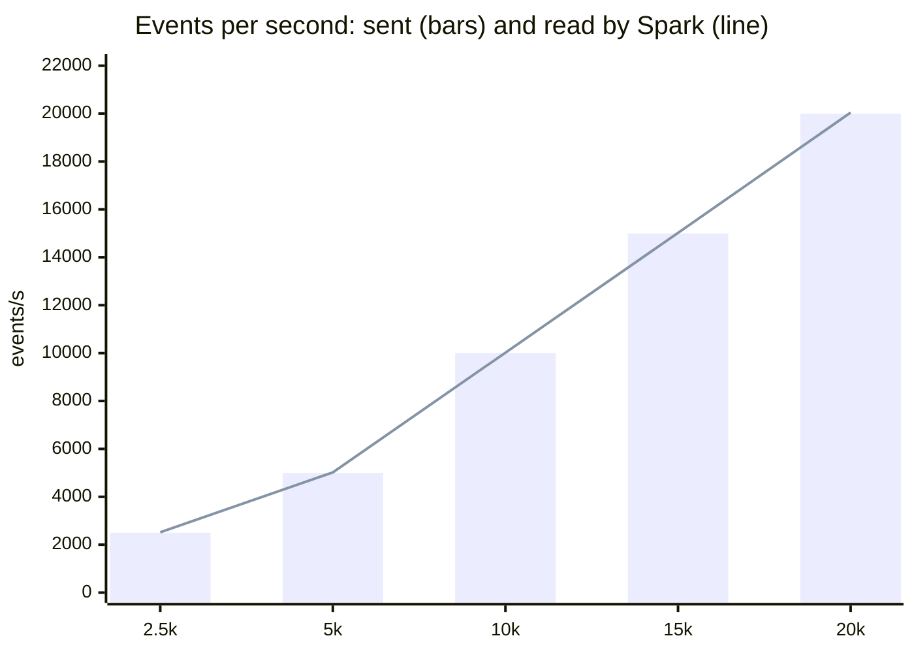

# Benchmarks

Measured on a single machine with Docker Compose, using the scripts in
`scripts/`. Re-run them to reproduce the figures. Each run replaces its own
section.

```bash
docker compose run --rm loadtest     # throughput and latency
docker compose run --rm recovery     # crash and restart
```

Kafka, Spark, MongoDB and the load generator all share the same CPU cores, so
these are figures for one laptop, not for a cluster.

<!-- recovery:start -->
## Recovery after a crash

Measured 2026-09-17 16:08 UTC with `docker compose run --rm recovery`: 500 test events/s, Spark killed with SIGKILL after 60 s and started again 60 s later, with traffic continuing throughout.

| | |
|---|---|
| Events read by the first batch after the restart (the backlog) | 38,471 |
| First new result after the restart | 12 s |
| Backlog cleared after the restart | 15 s |
| Events acknowledged by Kafka | 120,224 |
| Events counted in MongoDB | 120,224 (0 missing, 0 extra) |
| Windows stored twice | 0 |
| Minutes missing across the outage | 0 |

**Exactly-once results:** every event was counted once. A batch interrupted by the kill runs again after the restart. Spark resumes from the Kafka offsets and state in its checkpoint, and the MongoDB writes are upserts on the window key, so the re-run overwrites rows instead of adding to them (ADR 0004).

The time to the first result includes JVM and Spark start-up. The backlog clears in the first batch or two after that.
<!-- recovery:end -->

<!-- throughput:start -->
## Throughput and latency

Measured 2026-09-17 16:59 UTC with `docker compose run --rm loadtest`, 90 s per rate, 6 producer processes.

| Machine | |
|---|---|
| CPU | 13th Gen Intel(R) Core(TM) i5-13450HX |
| Cores / memory visible to Docker | 8 / 11.7 GB |
| Kafka partitions | 6 |
| Spark | `local[8]`, 8 shuffle partitions, rocksdb state store, trigger 10 seconds |

**Highest rate that kept up: 15,000 events/s.** Kept up means Spark read at least 90% of what was sent, the unread backlog did not climb once the step had settled, and Spark cleared what was left within two trigger intervals.

| Target events/s | Sent events/s | Spark read events/s | Batch p50 / max | Max unread | Cleared after | Event to trending row p50 / p95 | Kept up |
|---:|---:|---:|---:|---:|---:|---:|:--|
| 2,500 | 2,500 | 2,520 | 1.2 / 2.8 s | 7,322 | 9 s | 7.9 / 8.5 s | yes |
| 5,000 | 5,000 | 5,020 | 2.7 / 3.8 s | 19,391 | 10 s | 8.2 / 8.6 s | yes |
| 10,000 | 9,999 | 10,020 | 3.1 / 7.5 s | 77,786 | 11 s | 6.6 / 11.6 s | yes |
| 15,000 | 14,995 | 15,020 | 9.1 / 12.1 s | 184,616 | 16 s | 9.0 / 15.0 s | yes |
| 20,000 | 19,995 | 20,043 | 15.6 / 29.0 s | 588,494 | 31 s | 17.1 / 25.6 s | **no** |



How to read it:

- **Sent** is the rate the load generator achieved. It shares the CPU with Spark, so at high targets it can fall short of the target.
- **Spark read** is the trending query's own input rate. The pairing query reads the topic twice (it joins the stream with itself), so its figure is double.
- **Max unread** is the largest Kafka backlog Spark reported after a batch. Some backlog is normal: events keep arriving while a batch runs.
- **Event to trending row** is measured with probe events: the time from sending one event until its trending row is written. It includes up to one trigger interval of waiting (10 seconds) plus the batch itself.

### Event to product pair

25 pair probes: p50 5.1 min, p95 5.6 min, max 6.0 min.

This delay comes from the design, not from load. A pair is written once its 1-minute window has closed, the 2-minute co-view gap has passed and the 2-minute watermark has moved beyond both. That is about 5 minutes plus up to one trigger. See ADR 0001 and ADR 0002.
<!-- throughput:end -->
