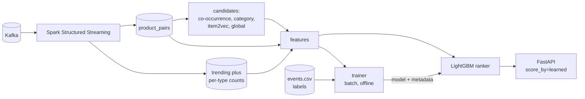

# Adding machine learning: the plan

Written September 2026, after v1.0.0. Phase 1 is built and measured (the
category baseline and the category fill, live at +5.4 points); everything
from phase 2 on is still a plan.
Every number in it was measured on the RetailRocket data with the scripts in
[experiments/ml-feasibility/](../experiments/ml-feasibility/), and every idea
was tested before it was kept or dropped. Start here when the ML work begins.

## The short version

Do this, in this order:

1. **Fix the baseline first (no ML). DONE.** The README used to compare the
   pipeline with global bestsellers, and that baseline was too weak. The ten most-viewed items
   in the *query's own category* score about as well as the pipeline does, at
   100% coverage. Report that baseline, and use it to fill the empty slots,
   which on its own lifts hit-rate@10 from 15.2% to 26.8% on the offline
   harness.
2. **Then add a learned re-ranker.** Candidates come from co-occurrence, the
   category, and item embeddings, and a LightGBM LambdaRank model orders them
   using features Spark already computes. It beat the best non-ML method by
   3.0 to 3.6 points of hit-rate@10 in three separate test weeks, with every
   95% interval well above zero.
3. **Widen the candidate pool** before anything fancier. Only 43.8% of the
   time is the right item among the candidates at all, and dropping the
   minimum pair count for candidates alone raises that to 49.2%.

Don't build sequence models (SASRec, GRU4Rec), purchase-intent prediction, bot
filtering, embeddings on their own, or LLM explanations. Each was checked
against this data and the reasons are below.

This is the standard shape of production recommenders in 2026: cheap
candidate generation, then a learned ranker over real-time features. It suits
this project because the hard part, fresh features from a stream, already
exists.

## About the category catalogue

Every number below uses a catalogue covering all 235,061 items (185,246 with a
category), built with `scripts/replay.py --dry-run --days 140`. A first run
used the catalogue left by a 30-day replay, which only knew that month's
items. The ranking of methods and the re-ranker's gain came out the same; the
category-based methods simply scored about a point lower. Use the full
catalogue.

## What the data allows

From `profile_data.py`, over all 2.76M events:

| Fact | Value | What it means |
|---|---:|---|
| Visits that look at exactly one item | 85.0% | most visits give a model nothing to predict from |
| Visits with 3 or more distinct items | 5.7% | long histories, which sequence models need, are rare |
| Visitors who come back (2+ visits) | 12.9% | personal history exists for few people |
| Visitors with 200+ events | 189, holding 4.7% of events | heavy users, but not junk (see below) |
| Visits with an add-to-cart / a purchase | 2.49% / 0.81% | purchase signals are rare |
| Test queries seen in the training month | 89.1% | 10.9% are cold start for any item model |
| Test targets seen in the training month | 91.8% | the ceiling for any model that only recommends known items |

## Every idea, tested

Offline harness, same split as the published evaluation: 30 days to train, the
next 7 to test, 14,018 test cases (first item of a visit, then the next item).
The co-occurrence here is an offline approximation of the pipeline's rule,
without Spark's one-minute windows, so compare rows with each other, not with
the README's live-API figures.

| Method | hit-rate@10 | Coverage | Verdict |
|---|---:|---:|---|
| Global bestsellers (the published baseline) | 0.72% | 100% | too weak to be the only baseline |
| Co-occurrence (the pipeline's rule) | 15.19% | 50.5% | the current system |
| Co-occurrence without visitors of 200+ events | 14.66% | 48.8% | **dropped**: filtering heavy users hurts |
| Co-occurrence without visitors of 50+ events | 13.81% | 46.9% | worse still |
| Item2vec on its own | 11.09% | 68.5% | **dropped as a recommender**, kept as a feature |
| **Category bestsellers** | **20.72%** | **100%** | the baseline to report and beat |
| Co-occurrence, then item2vec | 17.91% | 69.2% | beaten by the next row |
| **Co-occurrence, then category bestsellers** | **26.77%** | 100% | **phase 1**, no ML needed |
| **Learned re-ranker (LightGBM LambdaRank)** | **30.30%** | 100% | **phase 4** |

The re-ranker across three separate periods (`folds.py`, paired bootstrap,
1,000 resamples). Item2vec trains on two threads, so repeated runs move by
a few hundredths of a point. With the partial catalogue the gains were within
half a point of these.

| Test week | Cases | Best non-ML | Re-ranker | Gain | 95% interval |
|---|---:|---:|---:|---:|---|
| days 30 to 37 | 14,018 | 26.77% | 30.39% | +3.62 | +3.07 to +4.13 |
| days 60 to 67 | 14,013 | 23.93% | 27.02% | +3.09 | +2.56 to +3.55 |
| days 90 to 97 | 12,105 | 22.51% | 25.49% | +2.98 | +2.43 to +3.48 |

The features that carried the ranker, by gain: the share of the query's pairs
that go to this candidate, lift, whether the two items share a parent
category, how popular the query is, item2vec similarity, whether the two share
a category, how popular the candidate is, and its rank within its category.

How much each extra candidate source raises the ceiling (`candidates.py`):

| Candidate pool | Recall | Avg candidates |
|---|---:|---:|
| Co-occurrence (min 3 pairs), category, item2vec, global top 10 | 43.8% | 57 |
| plus co-occurrence with no minimum count | 49.2% | 61 |
| plus parent-category bestsellers | 50.1% | 77 |
| plus two-hop co-occurrence | 50.6% | 78 |
| plus the same visitor's other visits | 51.2% | 79 |

### Why the others were dropped

**Sequence models (SASRec, GRU4Rec, BERT4Rec).** They earn their keep by
reading a long history. Here 85% of visits have one item and 5.7% have three
or more, and the published task asks about the next item after the first one.
The model would have almost no sequence to read. Not built, and not worth
building on this dataset.

**Purchase-intent prediction.** Predicting an add-to-cart or purchase from a
visit's first three views reached ROC-AUC 0.557 (PR-AUC 0.139 against a 0.113
base rate). The top-scored tenth converts at 16.4% against 11.3%. That is too
weak to justify a model, a Spark scoring stage and a dashboard panel.

**Bot filtering.** The obvious idea, since 189 visitors hold 4.7% of events and
one visitor has 7,757. But removing visitors with 200+, 100+ or 50+ events made
co-occurrence worse every time. Heavy users here look like real power users
or staff, and their pairs carry signal.

**Item embeddings as the recommender.** Item2vec alone scored 11.1% and as a
fallback lost to category bestsellers. It is useful as one ranker feature, and
that is where it stays.

**Personalisation from past visits.** Only 12.9% of visitors return, and using
their other visits as a candidate source added half a point of recall. Not
worth a user model yet.

**LLM-written explanations.** RetailRocket hashes every item property, so
there is no product text to explain from, and the demo catalogue has twelve
products. Anything written would be invented.

**ALS or matrix factorisation.** Not measured. It is a batch method over a
user-item matrix, and with 85% single-item visits and 12.9% returning visitors
that matrix is almost empty. Revisit only if a dataset with user history
arrives.

## How it fits the pipeline



Two stages, and only the second is new. The pipeline already produces most
features: pair counts and lift come from `product_pairs`, popularity from
`trending`. The ranker is a few milliseconds of LightGBM per request inside the
API, not a new service.

### The one thing that must not go wrong: training and serving skew

If the trainer computes features one way and the API another, the offline gain
disappears in production without any error. So there is exactly one feature
function, `src/ranking/features.py`, and it reads the same MongoDB aggregates
the API reads. The trainer calls it too:

1. Replay days 0 to 23 through the real pipeline (the replay manifest records
   it).
2. For every visit in days 23 to 30, ask the feature function about its first
   item, exactly as the API would. Label the candidate the shopper went to next.
3. Train, and save the model with a metadata file: feature names in order,
   the training window from the manifest, the metrics, and the git commit.
4. The API refuses to load a model whose feature list differs from the code's,
   the same way `evaluate.py` refuses a mismatched replay.

The offline scripts in `experiments/` compute features straight from the CSV.
They proved the idea is worth building. They are not the implementation.

## Phases

Each phase ends with something measured through the live API, not the offline
harness.

### Phase 1: honest baseline and a better fallback (no ML)

- Add "category bestsellers" to `scripts/evaluate.py` and report it next to
  global bestsellers in the README and `docs/EVALUATION.md`.
- In `/related-products`, fill empty slots with the query category's
  bestsellers before trending. Report the source as `category_fallback`.
- Done when the live evaluation shows both baselines, and the pipeline with the
  new fallback beats category bestsellers on the same cases.

### Phase 2: wider candidates, without changing what users see

- Candidates use co-occurrence with no minimum count. `MIN_PAIR_COUNT` still
  decides what the co-occurrence ranking shows.
- Measure candidate recall through the API. Offline it went from 43.8% to
  49.2%.

### Phase 3: features from the stream

- Add `views`, `carts` and `purchases` counts to the trending aggregate in
  `src/streaming/transforms.py`. It currently stores a total, a weighted score
  and distinct users, with no split by event type.
- Write `src/ranking/features.py`, the single feature function, with unit
  tests over mongomock.
- Train item2vec in batch on the replayed window's visits, and ship the vectors
  as a file next to the model (27k items at 64 floats is about 7 MB).

### Phase 4: the trainer and the ranker

- `scripts/train_ranker.py`: the steps in the skew section, LightGBM
  LambdaRank, the same hyperparameters the feasibility run used, saved under
  `models/ranker/<version>/` as `model.txt` and `metadata.json`.
- `/related-products?score_by=learned`, falling back to affinity when no model
  is loaded or the query has no candidates. Record which one answered.
- Done when the live evaluation beats phase 1 on three separate test weeks
  with a paired bootstrap interval above zero, as `folds.py` did offline.
  Offline gain was 3.0 to 3.6 points. Expect less through the live pipeline
  and report whatever it is.

### Phase 5: running it like a real model

- Prometheus metrics: model version, answers by source, fallback rate, feature
  nulls, ranking latency (budget: under 20 ms at p95 on top of today's lookup).
- A Grafana row for the above, and an alert when the model is older than its
  retraining interval.
- Tests: feature function, metadata guard, fallback when the model is missing,
  and an end-to-end ranking over mongomock.

### Later, only if the numbers ask for it

- Parent-category and two-hop candidates (about 1.9 more points of recall
  offline).
- MLflow for tracking runs, once there is more than one model to compare.
- A sequence model, only on a dataset with longer visits.

## Risks

- **The offline gain may shrink live.** The harness approximates the pipeline's
  windows. Phase 4 measures through the API and reports the real number.
- **The demo catalogue has twelve products.** The ranker is trained on
  RetailRocket and means nothing for the demo items. The API must fall back
  to affinity for items the model has never seen, and say so.
- **Latency.** Measured in memory on 2 cores over 1,000 queries: building a
  query's features took 2.7 ms at the median and 6.8 ms at p95, and LightGBM
  scoring its 56 candidates on average took 2.7 ms and 7.7 ms. The live API
  adds its MongoDB reads on top, which is why the phase 5 budget is 20 ms.
- **Laptop limits.** Training took under a minute and the feature build about
  forty seconds on 2 CPU cores. A 30-day replay is already part of the
  workflow, so the new cost is one more replay for the training window.
- **Item2vec is not deterministic with two threads.** Runs differ by about a
  hundredth of a point. Fix the thread count to one in the trainer if exact
  reproduction matters more than speed.

## Reproducing the numbers

```bash
pip install -r requirements-ml.txt
python scripts/fetch_dataset.py
cd experiments/ml-feasibility
python profile_data.py     # about 1 minute
python baselines.py        # about 1 minute
python ranker.py           # about 4 minutes
python candidates.py       # about 2 minutes
python folds.py            # 15 to 20 minutes
```

## What it could say on a CV once built

Only after phase 4 is measured through the live API, and with that number:
"Two-stage recommender on a streaming pipeline: co-occurrence and category
candidates re-ranked by a LightGBM LambdaRank model on real-time Spark
features, beating the strongest non-ML baseline by N points of hit-rate@10
across three held-out weeks of real RetailRocket traffic."
